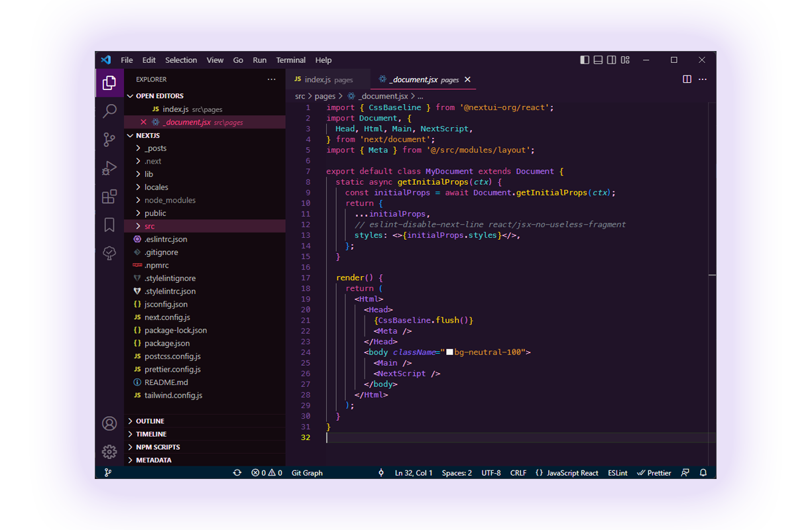

# 🌆 Melinoë theme for Visual Studio Code

## 👩‍💻 Installation

Open VS Code, then launch Quick Open (`Ctrl+P`). Paste in `ext install ltatarev.melinoe` and press enter.

To activate the theme, use the keyboard shortcut `Ctrl+K Ctrl+T` or select **File** > **Preferences** > **Color Theme** and choose **Melinoe**.

--

Starting point for this theme was created usng [themes.vscode.one](https://themes.vscode.one/)
